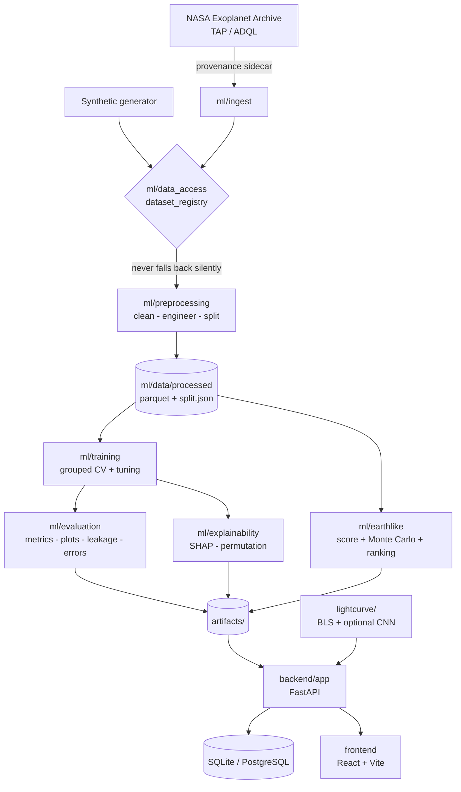
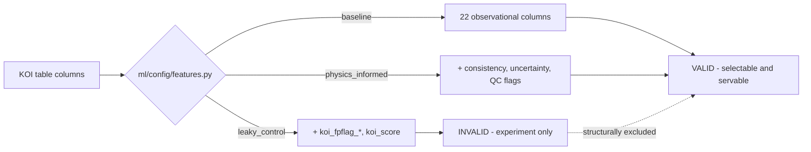

# ExoVision AI

**Physics-Informed Detection of Earth-Like Exoplanet Candidates Using NASA Kepler Data**

An end-to-end scientific machine learning system that deliberately refuses the
easiest source of accuracy in Kepler classification, and replaces it with
physics.

---

## 1. Project overview

Public Kepler classifiers routinely report 98–99% accuracy. This project starts
from the observation that such a number is usually measuring something other
than model quality, quantifies exactly how much, and then builds a classifier
that earns its performance from measurable physics instead.

What is here:

- A NASA Exoplanet Archive TAP client with provenance hashing
- A cleaning layer built on the rule *never drop rows on a label-correlated quantity*
- Physics-derived self-consistency features that replace the quarantined Robovetter columns
- Five models across three feature sets, cross-validated grouped by host star
- A leakage control experiment that quantifies the cost of doing it the easy way
- `EarthLikeScore` with Monte Carlo uncertainty propagation
- SHAP and permutation explainability
- A FastAPI backend, SQLAlchemy database, and React frontend
- Box Least Squares transit search on raw photometry
- An optional 1D CNN for light curve classification

**Current results are from synthetic validation data.** See §21.

---

## 2. Scientific motivation

Of roughly 9,600 Kepler Objects of Interest, a large fraction are not planets.
They are eclipsing binaries, background eclipsing binaries whose light is diluted
by the target star, stellar variability, and instrumental artefacts. Separating
these from genuine planets is the central problem, and it is what the Kepler
Robovetter was built to do.

The interesting question is not "can a model reproduce the Robovetter's
answers" — it can, trivially, because those answers are in the table. It is
whether the *physical reasoning* behind those answers can be recovered from
published measurements alone.

---

## 3. The transit method

When a planet crosses its star, the star dims by the ratio of projected areas:

```
depth ≈ (Rp / Rs)²
```

For Earth crossing the Sun that is **84 parts per million** — a 0.0084% dimming,
against a Kepler photometric precision of roughly 20–30 ppm for a bright quiet
star. The signal is real but marginal, which is why false positives dominate.

Two consequences run through the whole project:

1. **The transit measures a ratio, not a radius.** `koi_prad = koi_ror × koi_srad`.
   The planet's radius is only as well known as the star's, and for ~80% of KOIs
   the stellar radius comes from broadband photometry with a median fractional
   uncertainty near 30%.
2. **Anything that dilutes or distorts the light curve corrupts the inference.**
   A background eclipsing binary blended into the aperture produces a shallow,
   planet-shaped dip around the wrong star.

---

## 4. Why physics-informed machine learning?

The KOI table contains quantities measured **twice, by independent routes**.
Where the two disagree, the planet hypothesis is in trouble. That disagreement
is legitimate, learnable signal that owes nothing to the Robovetter's verdict.

| Feature | Two independent measurements of | Disagreement indicates |
|---|---|---|
| `f_abs_log_rho_ratio` | Stellar density: fitted from the transit shape vs. the stellar catalogue | Dilution, eccentricity, or a blended star |
| `f_duration_ratio` | Transit duration: observed vs. the geometric maximum | Impossible geometry, or a grazing eclipse |
| `f_depth_ratio` | Transit depth: measured vs. `(Rp/Rs)²` | Third light in the photometric aperture |

The density check is the strongest. `koi_srho` is fitted from the light curve's
period, depth and duration (Seager & Mallén-Ornelas 2003) and the archive states
it is independent of the listed stellar mass and radius, which come from
photometry and spectroscopy. Two routes to one number.

The duration check is a **hard bound**, not a learned threshold: for a circular
orbit `T = T₀·√(1−b²)`, so `T/T₀ ≤ 1` always. A value above 1 is not unlikely —
it is geometrically impossible.

---

## 5. Dataset

NASA Exoplanet Archive, Kepler Objects of Interest. See
[`docs/03-data-acquisition.md`](docs/03-data-acquisition.md) for table choice,
TAP queries, provenance, and what differs from the synthetic run.

```bash
python -m ml.ingest.download_koi --table cumulative
DATA_SOURCE=real python -m ml.preprocessing.build_dataset
```

Labels are mapped explicitly, never silently merged
([`ml/config/labels.py`](ml/config/labels.py)):

| `koi_disposition` | Binary target | Reason |
|---|---|---|
| CONFIRMED | 1 (planet-like) | Independently validated |
| CANDIDATE | 1 (planet-like) | Passed vetting, awaiting validation |
| FALSE POSITIVE | 0 | Failed at least one vetting test |
| NOT DISPOSITIONED | *held out* | Unlabelled; never trained or scored against |

CONFIRMED and CANDIDATE are not two kinds of object. They are the same kind at
two stages of follow-up, and whether follow-up happened depends on target
brightness, geometry, and telescope time allocation. A CONFIRMED-vs-CANDIDATE
classifier would partly learn astronomers' scheduling decisions.

---

## 6. Architecture



Feature-set resolution and the quarantine:



Directory layout:

```
ml/
├── config/          settings, labels, feature sets  (leaf — imports nothing downstream)
├── data_access/     dataset registry, synthetic + real loaders
├── ingest/          NASA TAP client, column taxonomy, audit
├── preprocessing/   constants, clean, features, splits, build_dataset
├── model_zoo/       five pipelines; preprocessing lives INSIDE each
├── training/        cross_validation, tuning, train
├── evaluation/      metrics, plots, compare_models, error_analysis, calibration
├── explainability/  shap_analysis, feature_importance
├── earthlike/       habitable_zone, score, rank_candidates
└── eda/             report
backend/app/         api/routes, services, schemas, database, core, main
lightcurve/          acquisition, preprocessing, transit_detection, visualization, deep_learning
frontend/src/        pages, components, lib
```

---

## 7. Anti-leakage methodology

The archive defines a false positive as an object that failed at least one of
the tests recorded in the `koi_fpflag_*` columns, and takes the non-CONFIRMED
values of `koi_disposition` from `koi_pdisposition`, the Robovetter's verdict.
`koi_score` is the fraction of Monte Carlo Robovetter iterations returning
CANDIDATE.

```
koi_fpflag_* ──(rule)──▶ koi_pdisposition ──(copied)──▶ koi_disposition
                                ▲
                          koi_score
```

These columns are quarantined. Five mechanisms enforce it:

1. `ml/config/features.QUARANTINED` is the single source of truth.
2. `resolve()` raises `AssertionError` if a quarantined column enters a valid set.
3. A test simulates the regression and asserts the raise.
4. `PredictionService.load()` refuses any artifact flagged `scientifically_valid: false`.
5. Primary-model selection is restricted to `VALID_FEATURE_SETS`, so the control
   cannot be selected however well it scores.

Four further rules, each with a test:

- **No preprocessing fitted before splitting.** Every imputer, scaler and encoder
  lives inside an sklearn `Pipeline`. A test fits on half the data and on all of
  it, and asserts the scaler means differ.
- **No SMOTE.** Real KOI imbalance is mild (~2:1). Synthesising minority rows on
  a grouped problem creates points belonging to no star, and applying it outside
  the fold leaks. `class_weight="balanced"` instead.
- **No host star in both splits.** `StratifiedGroupKFold` on `kepid`, persisted
  to `split.json` and read by every downstream module.
- **Never drop on a label-correlated quantity.** A 40 R⊕ "planet" is an eclipsing
  binary and is exactly the physics the model should learn. It is flagged
  (`qc_radius_implausible`), never deleted. The cleaning report breaks every drop
  down by class, and a test fails if any reason is more than 90% one class.

---

## 8. Physics consistency features

Verified against Solar System values in `tests/test_preprocessing.py`:

| Quantity | Computed | Expected |
|---|---|---|
| Mean solar density | 1.4101 g/cm³ | 1.408 |
| R☉ in Earth radii | 109.08 | 109.1 |
| a for P = 365.25 d, M = 1 M☉ | 1.000000 au | 1.0 |
| a/R★ for Earth | 214.9 | 215 |
| Central transit duration, Earth across Sun | 12.98 h | ~13 |
| Earth equilibrium temperature | 254.6 K | ~255 |
| Earth transit depth | 84.0 ppm | ~84 |

Separation by true physical cause (synthetic, median `|log₁₀(ρ_fit/ρ_cat)|`):

| True cause | Value |
|---|---|
| planet | **0.047** |
| eclipsing binary | 0.236 |
| diluted / background EB | **0.496** |
| not transit-like | 0.434 |

Nothing in the generator writes these features — false positives are produced by
simulating their physical cause — so this tests the feature, not the fixture.

---

## 9. Machine learning models

Five estimators, each wrapped in a `Pipeline`:

| Model | Preprocessing | Notes |
|---|---|---|
| Logistic regression | impute → scale → one-hot | Interpretable linear baseline |
| Random forest | impute → ordinal | Nonlinear, tolerant of skew |
| XGBoost | ordinal, **no numeric imputation** | Handles NaN natively — "missing" is splittable |
| SVM (RBF) | impute → scale → one-hot | Scaling is mandatory, not stylistic |
| MLP | impute → scale → one-hot | Tabular baseline; distinct from the light-curve CNN |

`HistGradientBoostingClassifier` substitutes automatically if XGBoost is absent.

Hyperparameter search is `RandomizedSearchCV` with 20 draws inside the same
persisted folds. Deliberately small: with grouped astronomical data and a few
thousand rows, variance between fold configurations exceeds the gain from an
exhaustive grid, and a search nobody runs is a search that never happens.

**Selection uses PR-AUC, never accuracy.** A majority-class predictor scores
~65% accuracy on this dataset while detecting nothing.

---

## 10. Leakage control experiment

| Feature set | Best model | Features | ROC-AUC | PR-AUC | F1 | Accuracy | Validity |
|---|---|---:|---:|---:|---:|---:|---|
| `baseline` | gradient_boosting | 22 | 0.9912 | 0.9922 | 0.9659 | 0.9633 | Valid |
| `physics_informed` | random_forest | 67 | 0.9956 | **0.9959** | 0.9708 | 0.9685 | Valid |
| `leaky_control` | random_forest | 27 | 1.0000 | 1.0000 | 1.0000 | 1.0000 | **INVALID — target leakage** |

*Synthetic validation data. See §21.*

The tallest bars belong to the model that must never be used. Every leaky figure
carries a `LEAKY CONTROL — NOT VALID FOR SCIENTIFIC USE` watermark burned into
the image, not only the caption — figures get separated from captions the moment
someone drops one into a slide deck.

Full write-up: [`docs/leakage_experiment.md`](docs/leakage_experiment.md).

---

## 11. EarthLikeScore

A project heuristic on 0–100. **Not a NASA classification, not a probability of
habitability, not evidence that anything supports life.**

Five smooth components, configurable weights:

| Component | Weight | Notes |
|---|---:|---|
| Radius | 0.30 | Log-space Gaussian on 1 R⊕ + soft rocky-ceiling roll-off at 1.8 R⊕ |
| Incident flux | 0.25 | Log-space Gaussian on 1 S⊕ |
| Equilibrium temperature | 0.15 | Centred on 255 K (equilibrium, **not** 288 K surface) |
| Habitable zone | 0.20 | Kopparapu et al. (2013; 2014 erratum), conservative or optimistic |
| Host star | 0.10 | Broad; M dwarfs are legitimate hosts, so a mild preference not a filter |

No hard cutoffs anywhere. `1.24` and `1.26` R⊕ differ by less than 0.05 in the
radius component, and a test asserts it.

Habitable zone verification — these coefficients give, for the Sun:

| Bounds | This implementation | Note |
|---|---|---|
| Optimistic (recent Venus → early Mars) | 0.750 – 1.766 au | Matches published values |
| Conservative (runaway → maximum greenhouse) | 0.981 – 1.689 au | Published inner edges span 0.95–0.99 depending on revision |

The ~4% spread on the conservative inner edge is a genuine revision difference,
documented in the docstring rather than papered over. It is smaller than the
stellar-parameter uncertainty on most KOIs, so it does not drive any result.

---

## 12. Uncertainty handling

The design point of the whole module, demonstrated:

| Case | Score | 5th–95th percentile |
|---|---:|---|
| Earth analogue, spectroscopic host (±3%) | **98.7** | 82.4 – 98.6 |
| Earth analogue, KIC-precision host (±30%) | **98.7** | **69.3 – 97.8** |

Same measurements, same point estimate. Only the interval reveals that one of
these is a much weaker claim. A score of "72" is meaningless; "72, 5th–95th
51–86" is usable.

Radius and flux are sampled in **log** space, because their errors are
multiplicative — a normal draw would place non-trivial mass at negative radius
for the ~30% fractional errors typical of KIC rows. Equilibrium temperature is
recomputed from each sampled flux (`T ∝ S^¼`) so the two stay physically
coupled rather than drifting into combinations that violate the relation they
were derived from.

`FAST_MODE` (200 draws) serves the API; `full_analysis` (5,000) serves notebooks.

Candidate ranking is conjunctive:

```
priority = P(planet-like) × (EarthLikeScore / 100) × data_quality
```

Multiplicative, because a candidate must clear all three to be worth telescope
time and a near-zero factor should dominate rather than be averaged away.

---

## 13. Light curve analysis

```bash
python -m lightcurve.run_analysis --demo              # synthetic, always runs
python -m lightcurve.run_analysis --kepid 11446443    # needs lightkurve + MAST
```

Pipeline: remove invalid → normalise → **asymmetric** sigma clip → flatten → BLS.

Two details that matter:

- **The sigma clip is asymmetric** (4σ upper, 20σ lower). An upward outlier is a
  cosmic ray; a downward one might be the transit you are looking for.
- **The flattening window must exceed the transit duration.** A filter narrower
  than the transit fits the transit and subtracts it out, and the pipeline
  reports a clean star. The window is recorded in the provenance so it can be
  compared against the duration.

Verified: BLS recovered an injected 8.5 d period as **8.500449 d**.

One bug found and fixed here: `astropy.timeseries.BoxLeastSquares` assumes unit
per-point uncertainty when no `dy` is passed, making its `depth_err` meaningless
for normalised flux. SNR is computed empirically from MAD scatter instead —
0.01 before the fix, 26.35 after.

Two cheap false-positive checks accompany every detection: odd/even depth ratio
(a background EB at twice the period) and secondary eclipse depth (a
self-luminous companion). Both are reported, neither auto-rejects.

---

## 14. Deep learning

Optional. **The tabular pipeline never depends on it.**

A dual-branch 1D CNN following Shallue & Vanderburg (2018): a global view (201
bins, full phase) and a local view (61 bins, transit window). Both are needed —
the global view sees a secondary eclipse at phase 0.5, the local view sees
ingress/egress shape (V-shaped = grazing binary, U-shaped = planet).

Split by **star**, not by curve. Normalisation statistics from the training
split only.

Without PyTorch, `build_classifier()` returns a gradient-boosting fallback and
every artifact records `is_fallback: true`. A tree model cannot exploit
translation invariance along the phase axis, which is most of why a convolutional
architecture suits this problem — the fallback keeps the module runnable, it does
not substitute for the CNN.

---

## 15. Installation

```bash
git clone <repo> && cd exoplanet-ai
python -m venv .venv && source .venv/bin/activate    # Python 3.11+
pip install -r requirements-dev.txt
```

Dependency groups, so the core pipeline is not held hostage to the optional parts:

| File | Contents |
|---|---|
| `requirements.txt` | Core tabular pipeline. Steps 1–4 run with only this. |
| `requirements-ml.txt` | + XGBoost, SHAP, FastAPI, SQLAlchemy |
| `requirements-astronomy.txt` | + astropy, lightkurve |
| `requirements-deep-learning.txt` | + torch |
| `requirements-dev.txt` | Everything + pytest, ruff |

```bash
cp .env.example .env    # then edit
```

---

## 16. Running the pipeline

```bash
python -m ml.preprocessing.build_dataset       # clean → engineer → split
python -m ml.eda.report                        # figures + findings
python -m ml.training.train --include-leaky    # all models, all feature sets
python -m ml.evaluation.compare_models         # leakage experiment + primary selection
python -m ml.evaluation.error_analysis
python -m ml.evaluation.calibration
python -m ml.explainability.feature_importance
python -m ml.explainability.shap_analysis
python -m ml.explainability.shap_analysis --explain-candidate K00872.02
python -m ml.earthlike.rank_candidates --top 20
python -m backend.app.database.ingest
```

Useful flags: `--dev` (fast subset), `--tune` (randomized search),
`--full-analysis` (5,000 Monte Carlo draws).

Switching to real data is configuration, not code:

```bash
DATA_SOURCE=real python -m ml.preprocessing.build_dataset
```

---

## 17. Running tests

```bash
pytest tests/ -q
```

**Current: 86 passed, 1 skipped.** The skip is the PyTorch CNN forward pass;
torch is not installed in the development environment.

---

## 18. Running the API

```bash
uvicorn backend.app.main:app --reload
# or: python -m backend.app.main
```

Interactive docs at `http://localhost:8000/docs`.

| Endpoint | Purpose |
|---|---|
| `GET /health` | Liveness, model-loaded state, data-source banner |
| `GET /api/planets` | Paginated, filterable, sortable catalogue |
| `GET /api/planets/{kepid}` | Full detail incl. consistency diagnostics |
| `GET /api/planets/koi/{name}` | Lookup by KOI name |
| `POST /api/predict` | Classify one candidate |
| `POST /api/explain` | SHAP attribution for one prediction |
| `POST /api/analyze-earth-like` | EarthLikeScore with confidence interval |
| `GET /api/top-earth-like-candidates` | Ranked follow-up list |
| `GET /api/models` | Trained models and metadata |
| `GET /api/model-performance` | Comparison + leakage experiment |
| `GET /api/feature-sets` | Definitions and the quarantine list |
| `GET /api/lightcurve/{kepid}` | Photometry + BLS search |

Models load once at lifespan startup. Nothing retrains inside a request, and
internal paths never reach a response body.

---

## 19. Running the frontend

```bash
cd frontend && npm install && npm run dev      # http://localhost:5173
```

Six pages: Overview, Explorer, Planet Detail, Earth-Like Candidates, Model
Performance (including "Why 99% Accuracy Can Be Wrong"), and Light Curve
Analyzer. The data-source banner is global and permanent, so a screenshot of one
page cannot misrepresent synthetic results as archive results.

---

## 20. Docker deployment

```bash
cp .env.example .env               # set POSTGRES_PASSWORD
docker compose up --build                            # backend + postgres
docker compose --profile pipeline run --rm pipeline  # build data, train, rank, ingest
docker compose --profile ui up --build               # + frontend on :5173
```

Artifacts and data are volumes, not image layers: a model baked into an image
cannot be retrained without a rebuild, and a dataset baked in cannot be audited
for provenance. Runs as a non-root user. No secrets in source.

---

## 21. Results

> **All numbers below come from SYNTHETIC VALIDATION DATA.** They demonstrate
> that the code detects what it claims to detect. They are **not** scientific
> findings and must not be presented as NASA results.

Primary model: `physics_informed__random_forest`, PR-AUC 0.9959.

**Feature importance.** Permutation importance ranks the stellar-density
consistency check first:

| Feature | Permutation importance (PR-AUC drop) |
|---|---:|
| `f_abs_log_rho_ratio` | **0.01046** |
| `f_rho_ratio` | 0.00594 |
| `f_log_rho_ratio` | 0.00579 |
| `koi_ror` | 0.00432 |
| `f_depth_expected_ppm` | 0.00421 |

79% of the top 14 features are physics-derived. SHAP attributes **77.9%** of
total contribution to them.

**Error analysis.** 100% of test errors are diluted/background eclipsing
binaries (11.4% error rate within that class); plain eclipsing binaries and
not-transit-like objects are at 0%. The physically hardest class is the one that
fails, which is the right failure mode.

**Expect real data to look different.** The synthetic generating process is
simple, so PR-AUC near 0.996 is not a forecast. Honest tabular KOI
classification without Robovetter columns lands closer to 0.93–0.96, and the gap
between physics-informed and baseline will be smaller.

---

## 22. Limitations

1. **KOI candidates are not confirmed planets.** CANDIDATE means "not yet
   refuted". Treating it as ground truth imports the catalogue's own error rate.
2. **Machine-learning predictions do not replace astrophysical validation.**
   Validation needs centroid analysis, radial velocity, or statistical validation
   against astrophysical false-positive priors — none of which is a tabular model.
3. **EarthLikeScore is not an official NASA metric.** It is a project heuristic
   with author-chosen weights.
4. **Equilibrium temperature is not surface temperature.** It assumes a Bond
   albedo of 0.3, blackbody star and planet, and even heat redistribution.
   Earth's 255 K equilibrium value sits 33 K below its mean surface temperature,
   and that gap is the greenhouse effect this quantity does not model.
5. **The habitable zone does not prove habitability.** It is a liquid-water proxy
   under stated atmospheric assumptions. It says nothing about whether a planet
   has an atmosphere, retained water, has a magnetic field, is tidally locked, or
   endures M-dwarf flares.
6. **Stellar parameter uncertainty dominates planet radius.** ~80% of KOIs carry
   KIC-provenance parameters with ~30% median fractional radius uncertainty —
   wider than the "Earth-sized" window itself. Gaia parallaxes later moved many
   Kepler planets across that boundary in both directions.
7. **Synthetic results are not scientific findings.** Every artifact carries a
   data-source banner for this reason.
8. **CNN transit classification does not independently confirm an exoplanet.** It
   scores how transit-like a photometric signal appears — a shape statistic, not
   a validation.

---

## 23. Future work

- Run the full pipeline on real archive data and publish a separate results
  document, keeping synthetic and real strictly apart
- Compare `q1_q17_dr25_koi` against `q1_q17_dr25_sup_koi` to quantify how much
  improved stellar parameters move the Earth-sized population
- Cross-match against Gaia DR3 for parallax-based stellar radii
- Extend the consistency framework to TESS, where dilution is worse because the
  pixels are larger
- Train the 1D CNN on real PDCSAP photometry rather than the fallback
- Multi-class task over the false-positive taxonomy, with the caveat in §5

---

## 24. Scientific disclaimer

This is an independent research and educational project. It is **not affiliated
with or endorsed by NASA**.

It does not detect extraterrestrial life, does not prove habitability, and does
not confirm exoplanets. It produces a prioritised list of candidates that merit
attention, together with an honest account of how uncertain each entry is.

Terminology used here means what it says: *Earth-sized candidate*, *potentially
Earth-like candidate*, *potentially habitable candidate*. Never "confirmed
habitable planet", never "the AI discovered an Earth".

Data courtesy of the NASA Exoplanet Archive, operated by Caltech under contract
with NASA's Exoplanet Exploration Program. KOI cumulative table DOI
`10.26133/NEA4`.

---

## Documentation

| Document | Contents |
|---|---|
| [`docs/01-science-brief.md`](docs/01-science-brief.md) | Transit physics, the leakage argument, column taxonomy |
| [`docs/02-eda-findings.md`](docs/02-eda-findings.md) | Cleaning rules, consistency features, what to check on real data |
| [`docs/03-data-acquisition.md`](docs/03-data-acquisition.md) | Obtaining NASA data, table choice, provenance |
| [`docs/leakage_experiment.md`](docs/leakage_experiment.md) | The leakage control experiment in full |
| [`FINDINGS.md`](FINDINGS.md) | Scientific report |
